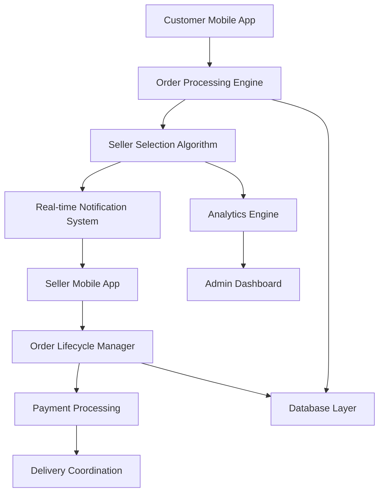

# 🛒 Comprehensive Order Management System Design
## Goat Goat Flutter Application

**Date**: 2025-08-16  
**Status**: Architectural Blueprint  
**Implementation**: Planning Phase Only

---

## 📋 **Executive Summary**

This document outlines a comprehensive order management system for the Goat Goat marketplace, designed to handle buyer-seller transactions with real-time notifications, intelligent order routing, and automated lifecycle management. The system incorporates best practices from leading marketplace platforms (Swiggy, Zomato, Uber Eats, Amazon) while addressing the unique requirements of a meat and livestock marketplace.

---

## 🎯 **Core Requirements Analysis**

### **Primary Objectives**
1. **Real-time Order Processing**: Instant seller notifications upon order placement
2. **Intelligent Order Routing**: Dynamic seller selection based on multiple factors
3. **Automated Lifecycle Management**: 5-minute acceptance timer with fallback mechanisms
4. **Scalable Architecture**: Support for high-volume concurrent orders
5. **Robust Error Handling**: Comprehensive edge case management

### **Key Performance Indicators**
- **Order Acceptance Rate**: >85% within 5 minutes
- **System Response Time**: <2 seconds for order placement
- **Notification Delivery**: <5 seconds to seller devices
- **Order Completion Rate**: >90% successful transactions
- **Customer Satisfaction**: <3% order cancellation rate

---

## 🏗️ **System Architecture Overview**

### **High-Level Components**


### **Technology Stack**
- **Frontend**: Flutter (iOS/Android)
- **Backend**: Supabase Edge Functions
- **Database**: PostgreSQL with RLS
- **Real-time**: Supabase Realtime + FCM
- **Notifications**: Firebase Cloud Messaging
- **Analytics**: Custom analytics service
- **Admin Panel**: Flutter Web

---

## 📊 **Database Schema Design**

### **Core Tables Structure**

#### **1. Orders Table**
```sql
CREATE TABLE orders (
    id UUID PRIMARY KEY DEFAULT gen_random_uuid(),
    customer_id UUID REFERENCES customers(id),
    seller_id UUID REFERENCES sellers(id),
    order_number VARCHAR(20) UNIQUE NOT NULL,
    
    -- Order Status Management
    status order_status_enum DEFAULT 'pending',
    substatus VARCHAR(50),
    
    -- Timing Controls
    created_at TIMESTAMPTZ DEFAULT NOW(),
    expires_at TIMESTAMPTZ, -- 5-minute acceptance deadline
    accepted_at TIMESTAMPTZ,
    confirmed_at TIMESTAMPTZ,
    completed_at TIMESTAMPTZ,
    cancelled_at TIMESTAMPTZ,
    
    -- Financial Information
    subtotal DECIMAL(10,2) NOT NULL,
    delivery_fee DECIMAL(8,2) DEFAULT 0,
    tax_amount DECIMAL(8,2) DEFAULT 0,
    total_amount DECIMAL(10,2) NOT NULL,
    
    -- Delivery Information
    delivery_address JSONB NOT NULL,
    delivery_coordinates POINT,
    estimated_delivery_time TIMESTAMPTZ,
    actual_delivery_time TIMESTAMPTZ,
    
    -- Metadata
    order_metadata JSONB DEFAULT '{}',
    cancellation_reason TEXT,
    special_instructions TEXT,
    
    -- Audit Trail
    created_by UUID,
    updated_at TIMESTAMPTZ DEFAULT NOW()
);

-- Order Status Enum
CREATE TYPE order_status_enum AS ENUM (
    'pending',           -- Just placed, waiting for seller acceptance
    'accepted',          -- Seller accepted, preparing order
    'confirmed',         -- Order confirmed, in preparation
    'ready_for_pickup',  -- Ready for delivery pickup
    'out_for_delivery',  -- Being delivered
    'delivered',         -- Successfully delivered
    'cancelled',         -- Cancelled by customer/seller/system
    'expired',           -- Expired due to no acceptance
    'failed'             -- Failed due to system error
);
```

#### **2. Order Items Table**
```sql
CREATE TABLE order_items (
    id UUID PRIMARY KEY DEFAULT gen_random_uuid(),
    order_id UUID REFERENCES orders(id) ON DELETE CASCADE,
    product_id UUID REFERENCES meat_products(id),
    
    -- Item Details
    product_name VARCHAR(255) NOT NULL,
    product_sku VARCHAR(100),
    quantity INTEGER NOT NULL CHECK (quantity > 0),
    unit_price DECIMAL(8,2) NOT NULL,
    total_price DECIMAL(10,2) NOT NULL,
    
    -- Product Snapshot (for historical accuracy)
    product_snapshot JSONB,
    
    -- Special Requirements
    special_requests TEXT,
    weight_preference VARCHAR(50),
    cut_preference VARCHAR(100),
    
    created_at TIMESTAMPTZ DEFAULT NOW()
);
```

#### **3. Order State Transitions Table**
```sql
CREATE TABLE order_state_transitions (
    id UUID PRIMARY KEY DEFAULT gen_random_uuid(),
    order_id UUID REFERENCES orders(id) ON DELETE CASCADE,
    
    -- State Change Information
    from_status order_status_enum,
    to_status order_status_enum NOT NULL,
    transition_reason VARCHAR(255),
    
    -- Actor Information
    triggered_by_user_id UUID,
    triggered_by_user_type VARCHAR(20), -- 'customer', 'seller', 'system', 'admin'
    
    -- Timing
    transitioned_at TIMESTAMPTZ DEFAULT NOW(),
    
    -- Additional Context
    metadata JSONB DEFAULT '{}',
    notes TEXT
);
```

#### **4. Seller Capacity Management**
```sql
CREATE TABLE seller_capacity (
    id UUID PRIMARY KEY DEFAULT gen_random_uuid(),
    seller_id UUID REFERENCES sellers(id) UNIQUE,
    
    -- Capacity Metrics
    max_concurrent_orders INTEGER DEFAULT 10,
    current_active_orders INTEGER DEFAULT 0,
    max_daily_orders INTEGER DEFAULT 100,
    current_daily_orders INTEGER DEFAULT 0,
    
    -- Availability Windows
    operating_hours JSONB, -- {"monday": {"open": "09:00", "close": "21:00"}, ...}
    is_currently_available BOOLEAN DEFAULT true,
    availability_status VARCHAR(50) DEFAULT 'available',
    
    -- Performance Metrics
    average_acceptance_time_seconds INTEGER DEFAULT 0,
    acceptance_rate_percentage DECIMAL(5,2) DEFAULT 100.0,
    average_preparation_time_minutes INTEGER DEFAULT 30,
    
    -- Temporary Overrides
    manual_override_until TIMESTAMPTZ,
    override_reason TEXT,
    
    -- Audit
    updated_at TIMESTAMPTZ DEFAULT NOW(),
    last_capacity_check TIMESTAMPTZ DEFAULT NOW()
);
```

#### **5. Order Routing Decisions**
```sql
CREATE TABLE order_routing_decisions (
    id UUID PRIMARY KEY DEFAULT gen_random_uuid(),
    order_id UUID REFERENCES orders(id),
    
    -- Routing Algorithm Results
    algorithm_version VARCHAR(20) NOT NULL,
    primary_seller_id UUID REFERENCES sellers(id),
    fallback_sellers UUID[] DEFAULT '{}',
    
    -- Decision Factors
    routing_factors JSONB, -- Distance, capacity, rating, etc.
    decision_score DECIMAL(8,4),
    
    -- Timing
    routing_completed_at TIMESTAMPTZ DEFAULT NOW(),
    routing_duration_ms INTEGER,
    
    -- Results
    routing_successful BOOLEAN DEFAULT true,
    failure_reason TEXT
);
```

---

## ⚡ **Real-Time Order Flow Logic**

### **Phase 1: Order Placement**
```typescript
// Customer places order
async function placeOrder(orderData: OrderRequest): Promise<OrderResponse> {
    // 1. Validate order data and inventory
    const validation = await validateOrderRequest(orderData);
    if (!validation.valid) throw new Error(validation.error);
    
    // 2. Calculate pricing and delivery fees
    const pricing = await calculateOrderPricing(orderData);
    
    // 3. Create order record with 5-minute expiry
    const order = await createOrder({
        ...orderData,
        ...pricing,
        status: 'pending',
        expires_at: new Date(Date.now() + 5 * 60 * 1000) // 5 minutes
    });
    
    // 4. Trigger seller selection algorithm
    const routingResult = await selectOptimalSeller(order);
    
    // 5. Send real-time notification to selected seller
    await notifySellerOfNewOrder(routingResult.primary_seller_id, order);
    
    // 6. Start 5-minute countdown timer
    await scheduleOrderExpiration(order.id, order.expires_at);
    
    // 7. Return order confirmation to customer
    return {
        success: true,
        order_id: order.id,
        order_number: order.order_number,
        estimated_acceptance_time: '2-5 minutes',
        seller_info: routingResult.seller_info
    };
}
```

### **Phase 2: Seller Selection Algorithm**
```typescript
interface SellerSelectionFactors {
    distance_km: number;
    current_capacity_utilization: number;
    average_acceptance_time: number;
    seller_rating: number;
    product_availability: boolean;
    delivery_zone_match: boolean;
    historical_performance: number;
}

async function selectOptimalSeller(order: Order): Promise<RoutingResult> {
    // 1. Get all eligible sellers
    const eligibleSellers = await getEligibleSellers({
        product_ids: order.items.map(item => item.product_id),
        delivery_location: order.delivery_coordinates,
        max_distance_km: 15
    });
    
    // 2. Calculate selection score for each seller
    const scoredSellers = await Promise.all(
        eligibleSellers.map(async (seller) => {
            const factors = await calculateSellerFactors(seller, order);
            const score = calculateSelectionScore(factors);
            
            return {
                seller_id: seller.id,
                seller_info: seller,
                factors,
                score
            };
        })
    );
    
    // 3. Sort by score (highest first)
    scoredSellers.sort((a, b) => b.score - a.score);
    
    // 4. Select primary seller and fallbacks
    const primary = scoredSellers[0];
    const fallbacks = scoredSellers.slice(1, 4); // Top 3 alternatives
    
    // 5. Record routing decision
    await recordRoutingDecision(order.id, {
        primary_seller_id: primary.seller_id,
        fallback_sellers: fallbacks.map(f => f.seller_id),
        routing_factors: primary.factors,
        decision_score: primary.score
    });
    
    return {
        primary_seller_id: primary.seller_id,
        seller_info: primary.seller_info,
        fallback_sellers: fallbacks
    };
}

function calculateSelectionScore(factors: SellerSelectionFactors): number {
    // Weighted scoring algorithm
    const weights = {
        distance: 0.25,           // Closer is better
        capacity: 0.20,           // Lower utilization is better
        acceptance_time: 0.15,    // Faster acceptance is better
        rating: 0.15,             // Higher rating is better
        availability: 0.10,       // Product availability
        delivery_zone: 0.10,      // Zone match bonus
        performance: 0.05         // Historical performance
    };
    
    let score = 0;
    
    // Distance score (inverse relationship)
    score += weights.distance * Math.max(0, (15 - factors.distance_km) / 15);
    
    // Capacity score (inverse utilization)
    score += weights.capacity * (1 - factors.current_capacity_utilization);
    
    // Acceptance time score (faster is better)
    score += weights.acceptance_time * Math.max(0, (300 - factors.average_acceptance_time) / 300);
    
    // Rating score (normalized to 0-1)
    score += weights.rating * (factors.seller_rating / 5.0);
    
    // Availability bonus
    score += weights.availability * (factors.product_availability ? 1 : 0);
    
    // Delivery zone bonus
    score += weights.delivery_zone * (factors.delivery_zone_match ? 1 : 0);
    
    // Performance score
    score += weights.performance * factors.historical_performance;
    
    return Math.round(score * 10000) / 10000; // 4 decimal precision
}
```

---

## 🔔 **Real-Time Notification System**

### **Notification Architecture**
```typescript
interface NotificationPayload {
    type: 'new_order' | 'order_update' | 'order_expired' | 'order_cancelled';
    order_id: string;
    priority: 'high' | 'medium' | 'low';
    data: any;
    expires_at?: string;
}

class OrderNotificationService {
    // Multi-channel notification delivery
    async notifySellerOfNewOrder(sellerId: string, order: Order): Promise<void> {
        const notification: NotificationPayload = {
            type: 'new_order',
            order_id: order.id,
            priority: 'high',
            data: {
                order_number: order.order_number,
                customer_name: order.customer_info.name,
                total_amount: order.total_amount,
                item_count: order.items.length,
                delivery_address: order.delivery_address.short_address,
                expires_at: order.expires_at,
                time_remaining_seconds: Math.floor((new Date(order.expires_at).getTime() - Date.now()) / 1000)
            },
            expires_at: order.expires_at
        };
        
        // Send via multiple channels for reliability
        await Promise.all([
            this.sendFCMNotification(sellerId, notification),
            this.sendRealtimeNotification(sellerId, notification),
            this.sendSMSBackup(sellerId, notification), // Fallback for critical orders
            this.updateSellerDashboard(sellerId, notification)
        ]);
        
        // Log notification delivery
        await this.logNotificationDelivery(sellerId, notification);
    }
    
    private async sendFCMNotification(sellerId: string, notification: NotificationPayload): Promise<void> {
        const seller = await this.getSellerById(sellerId);
        if (!seller.fcm_token) return;
        
        const fcmPayload = {
            token: seller.fcm_token,
            notification: {
                title: '🛒 New Order Received!',
                body: `Order #${notification.data.order_number} - ₹${notification.data.total_amount}`,
            },
            data: {
                type: notification.type,
                order_id: notification.order_id,
                action_required: 'accept_or_reject',
                deep_link: `goatgoat://orders/${notification.order_id}`,
                ...notification.data
            },
            android: {
                priority: 'high',
                notification: {
                    sound: 'order_notification',
                    channel_id: 'order_alerts',
                    priority: 'high',
                    visibility: 'public'
                }
            },
            apns: {
                payload: {
                    aps: {
                        sound: 'order_notification.wav',
                        badge: 1,
                        'content-available': 1
                    }
                }
            }
        };
        
        await this.fcmService.send(fcmPayload);
    }
}
```

---

## ⏱️ **Timer-Based Automation System**

### **5-Minute Acceptance Timer**
```typescript
class OrderLifecycleManager {
    async scheduleOrderExpiration(orderId: string, expiresAt: Date): Promise<void> {
        // Schedule using Supabase Edge Function with pg_cron or external scheduler
        const delay = expiresAt.getTime() - Date.now();
        
        // Use Supabase Edge Function with setTimeout for immediate scheduling
        await this.scheduleEdgeFunction('handle-order-expiration', {
            order_id: orderId,
            scheduled_for: expiresAt.toISOString()
        }, delay);
        
        // Also create database record for reliability
        await this.createScheduledTask({
            task_type: 'order_expiration',
            order_id: orderId,
            execute_at: expiresAt,
            status: 'scheduled'
        });
    }
    
    async handleOrderExpiration(orderId: string): Promise<void> {
        const order = await this.getOrderById(orderId);
        
        // Check if order is still pending
        if (order.status !== 'pending') {
            console.log(`Order ${orderId} already processed, skipping expiration`);
            return;
        }
        
        // Check if we're within grace period (30 seconds)
        const now = new Date();
        const gracePeriod = 30 * 1000; // 30 seconds
        
        if (now.getTime() < new Date(order.expires_at).getTime() + gracePeriod) {
            console.log(`Order ${orderId} still within grace period, extending timer`);
            await this.extendOrderTimer(orderId, 60); // Extend by 1 minute
            return;
        }
        
        // Attempt fallback seller routing
        const fallbackResult = await this.attemptFallbackRouting(orderId);
        
        if (fallbackResult.success) {
            console.log(`Order ${orderId} routed to fallback seller: ${fallbackResult.seller_id}`);
            await this.notifyCustomerOfSellerChange(orderId, fallbackResult.seller_info);
        } else {
            // No fallback available, cancel order
            await this.cancelOrderDueToExpiration(orderId);
        }
    }
    
    private async attemptFallbackRouting(orderId: string): Promise<FallbackResult> {
        const routingDecision = await this.getRoutingDecision(orderId);
        const fallbackSellers = routingDecision.fallback_sellers;
        
        for (const sellerId of fallbackSellers) {
            const seller = await this.getSellerById(sellerId);
            const capacity = await this.getSellerCapacity(sellerId);
            
            // Check if seller is still available and has capacity
            if (seller.is_currently_available && capacity.current_active_orders < capacity.max_concurrent_orders) {
                // Update order with new seller
                await this.updateOrderSeller(orderId, sellerId);
                
                // Send notification to new seller
                await this.notifySellerOfNewOrder(sellerId, await this.getOrderById(orderId));
                
                // Reset expiration timer
                const newExpiresAt = new Date(Date.now() + 5 * 60 * 1000);
                await this.updateOrderExpiration(orderId, newExpiresAt);
                await this.scheduleOrderExpiration(orderId, newExpiresAt);
                
                return {
                    success: true,
                    seller_id: sellerId,
                    seller_info: seller
                };
            }
        }
        
        return { success: false };
    }
}
```

---

## 🎨 **UI/UX Specifications**

### **Customer Order Flow Interface**

#### **1. Order Placement Screen**
```dart
class OrderPlacementScreen extends StatefulWidget {
  final List<CartItem> cartItems;
  final Map<String, dynamic> customer;

  @override
  Widget build(BuildContext context) {
    return Scaffold(
      appBar: AppBar(
        title: Text('Review Order'),
        backgroundColor: Colors.green[700],
      ),
      body: Column(
        children: [
          // Order Summary Card
          OrderSummaryCard(
            items: cartItems,
            subtotal: calculateSubtotal(),
            deliveryFee: calculateDeliveryFee(),
            total: calculateTotal(),
          ),

          // Delivery Address Section
          DeliveryAddressCard(
            address: selectedAddress,
            onAddressChange: _handleAddressChange,
            estimatedDeliveryTime: estimatedDeliveryTime,
          ),

          // Special Instructions
          SpecialInstructionsField(
            controller: instructionsController,
            maxLength: 200,
          ),

          // Payment Method Selection
          PaymentMethodSelector(
            selectedMethod: selectedPaymentMethod,
            onMethodChange: _handlePaymentMethodChange,
          ),

          Spacer(),

          // Place Order Button
          PlaceOrderButton(
            total: calculateTotal(),
            onPressed: _handlePlaceOrder,
            isLoading: isPlacingOrder,
          ),
        ],
      ),
    );
  }
}
```

#### **2. Order Tracking Screen**
```dart
class OrderTrackingScreen extends StatefulWidget {
  final String orderId;

  @override
  Widget build(BuildContext context) {
    return Scaffold(
      appBar: AppBar(
        title: Text('Order #${order.orderNumber}'),
        actions: [
          IconButton(
            icon: Icon(Icons.support_agent),
            onPressed: _contactSupport,
          ),
        ],
      ),
      body: StreamBuilder<Order>(
        stream: orderService.watchOrder(orderId),
        builder: (context, snapshot) {
          if (!snapshot.hasData) return LoadingIndicator();

          final order = snapshot.data!;

          return Column(
            children: [
              // Order Status Timeline
              OrderStatusTimeline(
                currentStatus: order.status,
                statusHistory: order.statusHistory,
                estimatedDeliveryTime: order.estimatedDeliveryTime,
              ),

              // Live Updates Section
              if (order.status == 'pending')
                PendingOrderCard(
                  sellerInfo: order.sellerInfo,
                  timeRemaining: order.timeRemaining,
                  onCancel: _handleCancelOrder,
                ),

              if (order.status == 'accepted')
                AcceptedOrderCard(
                  sellerInfo: order.sellerInfo,
                  estimatedPreparationTime: order.estimatedPreparationTime,
                  sellerPhone: order.sellerInfo.contactPhone,
                ),

              // Order Items List
              OrderItemsList(items: order.items),

              // Delivery Information
              DeliveryInfoCard(
                address: order.deliveryAddress,
                deliveryFee: order.deliveryFee,
                specialInstructions: order.specialInstructions,
              ),
            ],
          );
        },
      ),
    );
  }
}
```

### **Seller Order Management Interface**

#### **1. New Order Notification Screen**
```dart
class NewOrderNotificationScreen extends StatefulWidget {
  final Order order;
  final int timeRemainingSeconds;

  @override
  Widget build(BuildContext context) {
    return Scaffold(
      backgroundColor: Colors.green[50],
      appBar: AppBar(
        title: Text('New Order Received!'),
        backgroundColor: Colors.green[700],
        automaticallyImplyLeading: false,
      ),
      body: Padding(
        padding: EdgeInsets.all(16),
        child: Column(
          children: [
            // Countdown Timer
            CountdownTimerWidget(
              initialSeconds: timeRemainingSeconds,
              onExpired: _handleOrderExpired,
              warningThreshold: 60, // Show warning at 1 minute
            ),

            SizedBox(height: 20),

            // Order Overview Card
            OrderOverviewCard(
              orderNumber: order.orderNumber,
              customerName: order.customerInfo.name,
              totalAmount: order.totalAmount,
              itemCount: order.items.length,
              deliveryAddress: order.deliveryAddress.shortAddress,
            ),

            // Order Items Preview
            OrderItemsPreview(
              items: order.items,
              maxItemsToShow: 3,
            ),

            // Customer Information
            CustomerInfoCard(
              customer: order.customerInfo,
              deliveryAddress: order.deliveryAddress,
              specialInstructions: order.specialInstructions,
            ),

            Spacer(),

            // Action Buttons
            Row(
              children: [
                Expanded(
                  child: RejectOrderButton(
                    onPressed: _showRejectDialog,
                    isLoading: isProcessing,
                  ),
                ),
                SizedBox(width: 16),
                Expanded(
                  flex: 2,
                  child: AcceptOrderButton(
                    onPressed: _handleAcceptOrder,
                    isLoading: isProcessing,
                    estimatedPreparationTime: estimatedPrepTime,
                  ),
                ),
              ],
            ),
          ],
        ),
      ),
    );
  }
}
```

#### **2. Seller Dashboard with Order Queue**
```dart
class SellerDashboardScreen extends StatefulWidget {
  @override
  Widget build(BuildContext context) {
    return Scaffold(
      appBar: AppBar(
        title: Text('Seller Dashboard'),
        actions: [
          // Availability Toggle
          AvailabilityToggle(
            isAvailable: sellerStatus.isAvailable,
            onToggle: _handleAvailabilityToggle,
          ),

          // Notification Bell
          NotificationBell(
            unreadCount: unreadNotifications,
            onTap: _showNotifications,
          ),
        ],
      ),
      body: Column(
        children: [
          // Quick Stats Row
          QuickStatsRow(
            activeOrders: activeOrdersCount,
            todayRevenue: todayRevenue,
            averageRating: averageRating,
            completionRate: completionRate,
          ),

          // Order Queue Tabs
          OrderQueueTabs(
            pendingOrders: pendingOrders,
            activeOrders: activeOrders,
            completedOrders: todayCompletedOrders,
            onOrderTap: _handleOrderTap,
          ),

          // Capacity Indicator
          CapacityIndicator(
            currentLoad: currentActiveOrders,
            maxCapacity: maxConcurrentOrders,
            recommendedAction: getCapacityRecommendation(),
          ),
        ],
      ),
      floatingActionButton: FloatingActionButton(
        onPressed: _showQuickActions,
        child: Icon(Icons.add),
        backgroundColor: Colors.green[700],
      ),
    );
  }
}
```

---

## 🚨 **Error Handling & Edge Cases**

### **Critical Error Scenarios**

#### **1. Seller Unavailability During Order**
```typescript
class SellerUnavailabilityHandler {
  async handleSellerBecameUnavailable(sellerId: string, reason: string): Promise<void> {
    // Get all pending orders for this seller
    const pendingOrders = await this.getPendingOrdersForSeller(sellerId);

    for (const order of pendingOrders) {
      // Attempt immediate fallback routing
      const fallbackResult = await this.attemptFallbackRouting(order.id);

      if (fallbackResult.success) {
        // Notify customer of seller change
        await this.notifyCustomerOfSellerChange(order.id, {
          reason: 'seller_unavailable',
          newSeller: fallbackResult.seller_info,
          compensationOffered: this.calculateCompensation(order)
        });

        // Log the incident
        await this.logSellerUnavailabilityIncident(sellerId, order.id, reason);
      } else {
        // No fallback available - cancel with full refund
        await this.cancelOrderWithFullRefund(order.id, 'seller_unavailable');

        // Offer alternative suggestions
        await this.suggestAlternativeProducts(order.customer_id, order.items);
      }
    }

    // Update seller status and capacity
    await this.updateSellerAvailability(sellerId, false, reason);
  }
}
```

#### **2. Payment Processing Failures**
```typescript
class PaymentFailureHandler {
  async handlePaymentFailure(orderId: string, paymentError: PaymentError): Promise<void> {
    const order = await this.getOrderById(orderId);

    switch (paymentError.type) {
      case 'insufficient_funds':
        await this.handleInsufficientFunds(order);
        break;

      case 'payment_method_declined':
        await this.handlePaymentMethodDeclined(order);
        break;

      case 'network_timeout':
        await this.handleNetworkTimeout(order);
        break;

      case 'gateway_error':
        await this.handleGatewayError(order);
        break;

      default:
        await this.handleUnknownPaymentError(order, paymentError);
    }
  }

  private async handleInsufficientFunds(order: Order): Promise<void> {
    // Pause order processing
    await this.pauseOrderProcessing(order.id, 'payment_retry');

    // Notify customer with retry options
    await this.notifyCustomerPaymentIssue(order.customer_id, {
      type: 'insufficient_funds',
      order_id: order.id,
      amount_required: order.total_amount,
      retry_options: [
        'add_different_payment_method',
        'reduce_order_amount',
        'cancel_order'
      ],
      retry_deadline: new Date(Date.now() + 15 * 60 * 1000) // 15 minutes
    });

    // Schedule automatic cancellation if not resolved
    await this.schedulePaymentRetryTimeout(order.id, 15 * 60 * 1000);
  }
}
```

#### **3. Network Connectivity Issues**
```typescript
class ConnectivityHandler {
  async handleOfflineScenario(userId: string, userType: 'customer' | 'seller'): Promise<void> {
    if (userType === 'seller') {
      // Critical: Seller went offline during active orders
      const activeOrders = await this.getActiveOrdersForSeller(userId);

      for (const order of activeOrders) {
        // Send SMS backup notifications
        await this.sendSMSBackupNotification(userId, {
          type: 'connectivity_issue',
          order_id: order.id,
          action_required: 'contact_customer_or_support',
          support_phone: SUPPORT_PHONE_NUMBER
        });

        // Notify customers of potential delay
        await this.notifyCustomerOfSellerConnectivityIssue(order.customer_id, {
          order_id: order.id,
          estimated_resolution_time: '10-15 minutes',
          alternative_contact: order.seller_info.contact_phone
        });
      }

      // Mark seller as temporarily unavailable
      await this.setSellerTemporaryUnavailability(userId, 'connectivity_issue');
    }
  }
}
```

---

## 📊 **Comparative Analysis: Leading Marketplace Apps**

### **Swiggy Order Management Analysis**

#### **Strengths**
- **Multi-restaurant fallback**: Automatic routing to alternative restaurants
- **Real-time ETA updates**: Dynamic delivery time adjustments
- **Proactive communication**: SMS + Push + In-app notifications
- **Smart batching**: Efficient delivery route optimization

#### **Implementation for Goat Goat**
```typescript
// Swiggy-inspired fallback system
class SwiggyInspiredFallbackSystem {
  async handleRestaurantUnavailable(orderId: string): Promise<void> {
    const order = await this.getOrderById(orderId);

    // Find similar restaurants with same cuisine
    const alternatives = await this.findSimilarSellers({
      cuisine_type: order.seller_info.cuisine_type,
      location: order.delivery_coordinates,
      price_range: order.seller_info.price_range,
      rating_threshold: 4.0
    });

    // Offer customer choice of alternatives
    await this.offerAlternativeSellerChoice(order.customer_id, {
      original_order: order,
      alternatives: alternatives,
      compensation: {
        discount_percentage: 10,
        free_delivery: true
      }
    });
  }
}
```

### **Zomato's Order Tracking System**

#### **Strengths**
- **Granular status updates**: 8+ distinct order states
- **Live order tracking**: Real-time preparation progress
- **Customer communication**: Direct chat with restaurant
- **Quality assurance**: Post-delivery feedback integration

#### **Implementation for Goat Goat**
```typescript
// Zomato-inspired detailed tracking
enum DetailedOrderStatus {
  ORDER_PLACED = 'order_placed',
  PAYMENT_CONFIRMED = 'payment_confirmed',
  SELLER_NOTIFIED = 'seller_notified',
  ORDER_ACCEPTED = 'order_accepted',
  PREPARATION_STARTED = 'preparation_started',
  ORDER_READY = 'order_ready',
  PICKUP_ASSIGNED = 'pickup_assigned',
  OUT_FOR_DELIVERY = 'out_for_delivery',
  DELIVERED = 'delivered'
}

class DetailedOrderTracking {
  async updateOrderStatus(orderId: string, status: DetailedOrderStatus, metadata?: any): Promise<void> {
    // Update order status
    await this.updateOrder(orderId, { status, updated_at: new Date() });

    // Log status transition
    await this.logStatusTransition(orderId, status, metadata);

    // Send real-time update to customer
    await this.sendRealtimeUpdate(orderId, {
      status,
      message: this.getStatusMessage(status),
      estimated_time: this.calculateEstimatedTime(status, metadata),
      actions_available: this.getAvailableActions(status)
    });

    // Trigger any automated actions
    await this.triggerAutomatedActions(orderId, status);
  }
}
```

### **Amazon's Seller Load Balancing**

#### **Strengths**
- **Predictive capacity management**: ML-based demand forecasting
- **Dynamic pricing**: Surge pricing during high demand
- **Seller performance scoring**: Multi-factor seller ranking
- **Geographic optimization**: Zone-based seller selection

#### **Implementation for Goat Goat**
```typescript
// Amazon-inspired capacity management
class AmazonInspiredCapacityManager {
  async predictSellerCapacity(sellerId: string, timeWindow: number): Promise<CapacityPrediction> {
    const historicalData = await this.getSellerHistoricalData(sellerId, 30); // 30 days
    const currentMetrics = await this.getCurrentSellerMetrics(sellerId);

    // Simple ML model for capacity prediction
    const prediction = {
      predicted_orders: this.predictOrderVolume(historicalData, timeWindow),
      confidence_level: this.calculateConfidence(historicalData),
      recommended_capacity: this.calculateOptimalCapacity(currentMetrics),
      surge_pricing_recommended: this.shouldApplySurgePricing(currentMetrics)
    };

    return prediction;
  }

  private predictOrderVolume(historicalData: any[], timeWindow: number): number {
    // Simplified prediction algorithm
    const averageOrdersPerHour = historicalData.reduce((sum, day) =>
      sum + day.orders_per_hour, 0) / historicalData.length;

    const timeOfDayMultiplier = this.getTimeOfDayMultiplier(new Date().getHours());
    const dayOfWeekMultiplier = this.getDayOfWeekMultiplier(new Date().getDay());

    return Math.round(averageOrdersPerHour * timeOfDayMultiplier * dayOfWeekMultiplier * (timeWindow / 60));
  }
}
```

### **Uber Eats' Real-Time Optimization**

#### **Strengths**
- **Dynamic delivery zones**: Real-time zone boundary adjustments
- **Demand-supply balancing**: Automatic seller availability management
- **Route optimization**: AI-powered delivery route planning
- **Surge management**: Dynamic pricing and capacity allocation

#### **Implementation for Goat Goat**
```typescript
// Uber Eats-inspired real-time optimization
class RealTimeOptimizationEngine {
  async optimizeOrderRouting(): Promise<void> {
    // Get current system state
    const systemState = await this.getCurrentSystemState();

    // Analyze demand patterns
    const demandAnalysis = await this.analyzeDemandPatterns(systemState);

    // Optimize seller availability
    await this.optimizeSellerAvailability(demandAnalysis);

    // Adjust delivery zones
    await this.adjustDeliveryZones(demandAnalysis);

    // Update routing algorithms
    await this.updateRoutingWeights(demandAnalysis);
  }

  private async optimizeSellerAvailability(demandAnalysis: DemandAnalysis): Promise<void> {
    for (const zone of demandAnalysis.high_demand_zones) {
      const availableSellers = await this.getSellersInZone(zone.id);
      const demandRatio = zone.demand / availableSellers.length;

      if (demandRatio > 2.0) { // High demand threshold
        // Suggest sellers to extend hours or increase capacity
        await this.suggestCapacityIncrease(availableSellers, {
          incentive_percentage: 15,
          suggested_extension_hours: 2,
          priority_order_routing: true
        });
      }
    }
  }
}
```

---

## 🛣️ **Implementation Roadmap**

### **Phase 1: Foundation (Weeks 1-4)**
- ✅ Database schema implementation
- ✅ Basic order placement and tracking
- ✅ Simple seller notification system
- ✅ 5-minute timer implementation
- ✅ Basic UI components

### **Phase 2: Core Features (Weeks 5-8)**
- 🔄 Advanced seller selection algorithm
- 🔄 Real-time notification system
- 🔄 Order state management
- 🔄 Payment integration
- 🔄 Basic error handling

### **Phase 3: Optimization (Weeks 9-12)**
- ⏳ Fallback routing system
- ⏳ Capacity management
- ⏳ Performance monitoring
- ⏳ Advanced analytics
- ⏳ Load testing

### **Phase 4: Advanced Features (Weeks 13-16)**
- ⏳ ML-based seller selection
- ⏳ Predictive capacity management
- ⏳ Dynamic pricing
- ⏳ Advanced error recovery
- ⏳ Comprehensive testing

---

## 🎯 **Success Metrics & KPIs**

### **Operational Metrics**
- **Order Acceptance Rate**: Target >85%
- **Average Acceptance Time**: Target <2 minutes
- **Order Completion Rate**: Target >90%
- **Customer Satisfaction**: Target >4.5/5
- **Seller Satisfaction**: Target >4.0/5

### **Technical Metrics**
- **System Response Time**: Target <2 seconds
- **Notification Delivery**: Target <5 seconds
- **Uptime**: Target >99.9%
- **Error Rate**: Target <1%
- **Scalability**: Support 1000+ concurrent orders

### **Business Metrics**
- **Revenue per Order**: Track growth
- **Customer Retention**: Target >70%
- **Seller Retention**: Target >80%
- **Order Frequency**: Target 2+ orders/customer/month
- **Market Penetration**: Geographic expansion metrics

---

## 🔒 **Security & Compliance**

### **Data Protection**
- End-to-end encryption for sensitive data
- PCI DSS compliance for payment processing
- GDPR compliance for user data
- Regular security audits and penetration testing

### **Business Continuity**
- Disaster recovery procedures
- Data backup and restoration
- Failover mechanisms
- Business continuity planning

---

## 📈 **Scalability Considerations**

### **Horizontal Scaling**
- Microservices architecture
- Load balancing strategies
- Database sharding
- CDN implementation

### **Performance Optimization**
- Caching strategies
- Database indexing
- Query optimization
- Real-time data processing

---

**Status**: 🎯 **COMPREHENSIVE ARCHITECTURAL BLUEPRINT COMPLETE**

This document provides a complete architectural foundation for implementing a world-class order management system for the Goat Goat marketplace, incorporating best practices from leading platforms while addressing the unique requirements of a meat and livestock marketplace.
