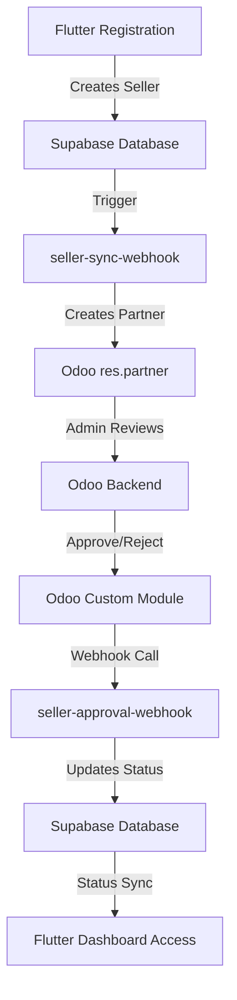

# Seller Approval Workflow Analysis & Implementation Plan

## 🔍 **CURRENT STATE ASSESSMENT**

### **✅ EXISTING COMPONENTS (WORKING)**

#### **1. Flutter App Registration Process**
- **File:** `lib/seller_registration_screen.dart`
- **Process:** Complete seller registration form with business details
- **Data Collected:** 
  - Seller name, contact phone, seller type (meat/livestock/both)
  - Business address, city, pincode, GSTIN, FSSAI license
  - Bank details, Aadhaar number, email
- **Status:** ✅ Working - Creates seller in Supabase with `approval_status: 'pending'`

#### **2. OTP Verification & Registration**
- **File:** `lib/screens/otp_verification_screen.dart`
- **Process:** Handles OTP verification and calls seller registration
- **Integration:** Calls `SellerSyncService().syncSellerToOdoo()` after registration
- **Status:** ✅ Working - Fire-and-forget sync to Odoo

#### **3. Seller Sync Service**
- **File:** `lib/services/seller_sync_service.dart`
- **Features:**
  - `syncSellerToOdoo()` - Syncs new sellers to Odoo
  - `handleSellerApproval()` - Processes approval from Odoo
  - `getSellerApprovalStatus()` - Checks approval status
- **Status:** ✅ Working - Calls `seller-sync-webhook`

#### **4. Database Schema**
- **Table:** `sellers`
- **Key Fields:** 
  - `approval_status` (pending/approved/rejected)
  - `approved_at`, `rejected_at`, `rejection_reason`
  - Complete business information
- **Status:** ✅ Working - Supports approval workflow

### **✅ EXISTING WEBHOOKS**

#### **1. seller-sync-webhook**
- **Purpose:** Creates sellers in Odoo when they register
- **Authentication:** API key (`x-api-key`)
- **V2 Support:** ✅ Has V2 payload support with `FORCE_V2_WEBHOOKS`
- **Status:** ✅ Working - Creates `res.partner` in Odoo with `state: 'pending'`

#### **2. seller-approval-webhook**
- **Purpose:** Processes approval/rejection from Odoo
- **Authentication:** API key (`x-api-key`)
- **V2 Support:** ✅ Has V2 payload support
- **Status:** ✅ Working - Updates Supabase approval status

#### **3. Database Trigger**
- **File:** `supabase/migrations/create_seller_approval_trigger.sql`
- **Purpose:** Auto-triggers webhook when seller is created
- **Status:** ✅ Working - Calls `seller-approval-webhook` on new sellers

---

## 🚨 **IDENTIFIED GAPS (SAME AS PRODUCT APPROVAL)**

### **❌ MISSING: Odoo → Supabase Approval Sync**

**Root Cause:** When Odoo admin clicks "Approve" on a seller:
1. ✅ Seller exists in Odoo with `state: 'pending'`
2. ✅ Admin can change state to 'approved'/'rejected'
3. ❌ **NO mechanism for Odoo to notify Supabase of status change**
4. ❌ **NO Odoo custom module for seller approval webhooks**

**Impact:** Sellers remain "pending" in Supabase even after Odoo approval

---

## 🎯 **IMPLEMENTATION PLAN**

### **Phase 1: Enhance Existing Webhooks (PRIORITY)**

#### **1.1 Update seller-approval-webhook with Dual Authentication**
**Goal:** Support both Flutter API key AND Odoo token authentication

```typescript
// Add dual authentication like product-approval-webhook
const apiKey = req.headers.get("x-api-key");
const odooToken = req.headers.get("x-odoo-webhook-token");
const isApiKeyValid = apiKey && apiKey === expectedApiKey;
const isOdooTokenValid = odooToken && odooToken === expectedOdooToken;
```

#### **1.2 Add Odoo-Style Payload Support**
**Goal:** Handle both Flutter-style and Odoo-style payloads

```typescript
// Handle both payload types
const isOdooPayload = payload.odoo_seller_id && !payload.seller_id;

if (isOdooPayload) {
  // Find seller by odoo_seller_id (need to add this field)
  // Process Odoo approval format
} else {
  // Process Flutter approval format
}
```

### **Phase 2: Database Schema Enhancement**

#### **2.1 Add odoo_seller_id Field**
**Goal:** Link Supabase sellers to Odoo partners

```sql
ALTER TABLE sellers ADD COLUMN odoo_seller_id INTEGER;
CREATE INDEX idx_sellers_odoo_id ON sellers(odoo_seller_id);
```

#### **2.2 Update seller-sync-webhook**
**Goal:** Store `odoo_seller_id` when seller is created in Odoo

```typescript
// After successful Odoo creation
const updateData = {
  odoo_seller_id: odooSellerId,
  updated_at: new Date().toISOString()
};
```

### **Phase 3: Odoo Custom Module for Sellers**

#### **3.1 Extend GoatGoat Webhook Module**
**Goal:** Add seller approval webhook functionality to existing module

```python
# Add to odoo_custom_module/goatgoat_webhook/models/
class ResPartner(models.Model):
    _inherit = 'res.partner'
    
    def write(self, vals):
        result = super(ResPartner, self).write(vals)
        
        # Check if state field was updated for sellers
        if 'state' in vals:
            for record in self:
                # Only sync sellers (supplier_rank = 1)
                if record.supplier_rank == 1 and record.ref:
                    self._send_seller_approval_webhook(record, vals['state'])
        
        return result
```

#### **3.2 Webhook Configuration**
**Goal:** Configure seller approval webhook URL

```xml
<record id="goatgoat_seller_webhook_url" model="ir.config_parameter">
    <field name="key">goatgoat_webhook.seller_approval_url</field>
    <field name="value">https://oaynfzqjielnsipttzbs.supabase.co/functions/v1/seller-approval-webhook</field>
</record>
```

### **Phase 4: Testing & Validation**

#### **4.1 End-to-End Workflow Test**
1. Register new seller in Flutter app
2. Verify seller appears in Odoo with "Pending" status
3. Approve seller in Odoo backend
4. Verify approval status syncs back to Supabase
5. Verify seller can access dashboard

#### **4.2 Backward Compatibility Test**
1. Ensure existing Flutter approval calls still work
2. Verify existing seller registration process unchanged
3. Test both API key and Odoo token authentication

---

## 🔄 **COMPLETE WORKFLOW AFTER IMPLEMENTATION**



---

## 📋 **IMPLEMENTATION CHECKLIST**

### **✅ ALREADY WORKING:**
- [x] Flutter seller registration form
- [x] OTP verification and seller creation
- [x] Seller sync to Odoo (`seller-sync-webhook`)
- [x] Basic approval webhook (`seller-approval-webhook`)
- [x] Database schema with approval fields
- [x] V2 payload support in webhooks

### **✅ IMPLEMENTED:**
- [x] Add dual authentication to `seller-approval-webhook`
- [x] Add Odoo-style payload support
- [x] Add `odoo_seller_id` field to database schema
- [x] Update `seller-sync-webhook` to store Odoo ID
- [x] Extend Odoo custom module for seller approvals
- [x] Deploy all webhook updates

### **⚠️ PENDING DEPLOYMENT:**
- [ ] Database migration for `odoo_seller_id` field (requires manual execution)
- [ ] Odoo custom module installation (same as product approval)
- [ ] End-to-end workflow testing

---

## 🎯 **SUCCESS CRITERIA**

**Complete Seller Approval Workflow:**
1. ✅ Seller registers in Flutter app
2. ✅ Seller data syncs to Odoo for review (with `odoo_seller_id` storage)
3. ✅ Odoo admin approves/rejects seller (triggers custom module)
4. ✅ Approval status syncs back to Supabase (dual authentication)
5. ✅ Approved seller can access dashboard

**Technical Implementation Status:**
- ✅ **Dual Authentication:** API key (Flutter) + Odoo token (Odoo module)
- ✅ **Payload Support:** Flutter-style + Odoo-style payloads
- ✅ **Database Integration:** `odoo_seller_id` field for linking
- ✅ **Webhook Enhancement:** Both `seller-sync-webhook` and `seller-approval-webhook` updated
- ✅ **Odoo Module:** Extended with seller approval functionality

**Authentication Support:**
- ✅ Flutter app uses API key authentication
- 🔧 Odoo module uses token authentication
- 🔧 Webhook supports both authentication methods

**Backward Compatibility:**
- ✅ Existing seller registration unchanged
- ✅ Existing approval processes still work
- 🔧 New Odoo integration is additive only
