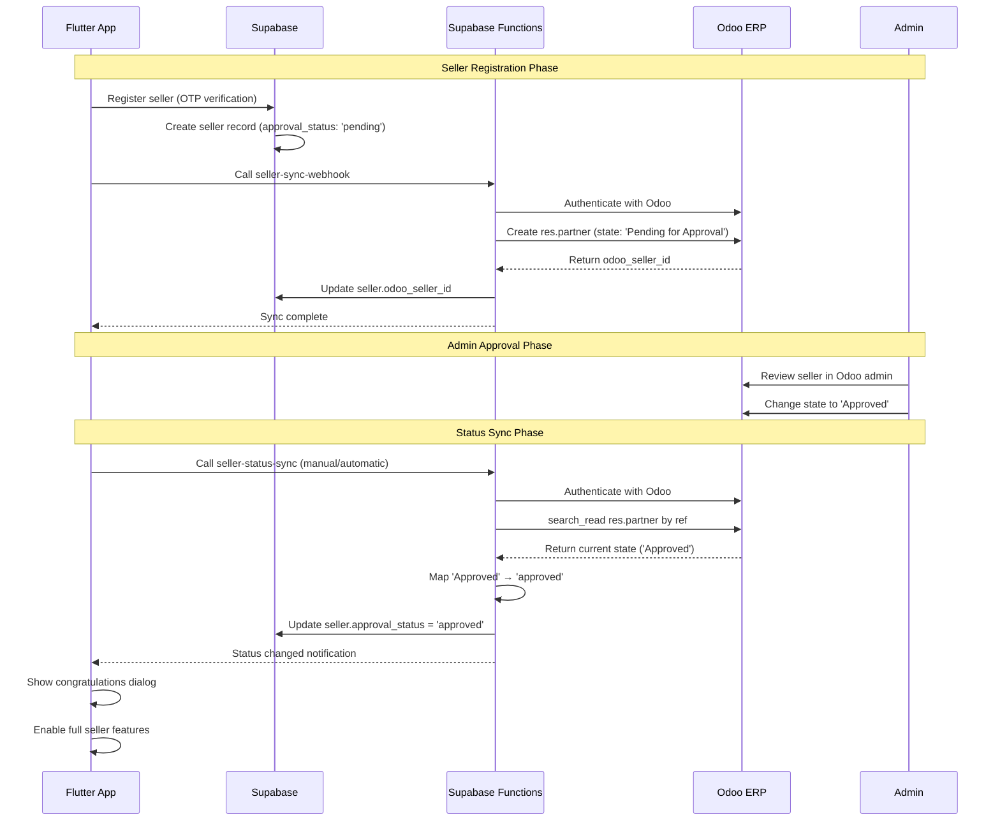

# Seller Approval Odoo Integration Documentation

## Table of Contents
1. [System Architecture & Flow](#1-system-architecture--flow)
2. [Edge Functions Documentation](#2-edge-functions-documentation)
3. [API Specifications](#3-api-specifications)
4. [Webhook System](#4-webhook-system)
5. [Database Schema](#5-database-schema)
6. [Flutter Integration](#6-flutter-integration)
7. [Troubleshooting Guide](#7-troubleshooting-guide)
8. [Configuration & Deployment](#8-configuration--deployment)
9. [Testing & Verification](#9-testing--verification)

---

## 1. System Architecture & Flow

### 1.1 Complete End-to-End Seller Approval Workflow



### 1.2 Data Flow Architecture

```
┌─────────────────┐    ┌─────────────────┐    ┌─────────────────┐
│   Flutter App   │    │    Supabase     │    │   Odoo ERP      │
│                 │    │                 │    │                 │
│ ┌─────────────┐ │    │ ┌─────────────┐ │    │ ┌─────────────┐ │
│ │   Seller    │ │    │ │   sellers   │ │    │ │ res.partner │ │
│ │ Dashboard   │◄├────┤ │   table     │ │    │ │   model     │ │
│ └─────────────┘ │    │ └─────────────┘ │    │ └─────────────┘ │
│                 │    │        ▲        │    │        ▲        │
│ ┌─────────────┐ │    │        │        │    │        │        │
│ │ Status Sync │ │    │ ┌─────────────┐ │    │ ┌─────────────┐ │
│ │   Service   │◄├────┤ │Edge Functions│◄├────┤ │   JSON-RPC  │ │
│ └─────────────┘ │    │ └─────────────┘ │    │ │     API     │ │
└─────────────────┘    └─────────────────┘    └─────────────┘
```

### 1.3 Integration Points

| Component | Purpose | Dependencies |
|-----------|---------|--------------|
| **seller-sync-webhook** | Create sellers in Odoo | Supabase DB, Odoo API |
| **seller-status-sync** | Sync approval status | Supabase DB, Odoo API |
| **seller-approval-webhook** | Handle approval callbacks | Supabase DB, Odoo Module |
| **SellerSyncService** | Flutter → Supabase sync | Supabase Client |
| **SellerStatusSyncService** | Status checking | Supabase Functions |

---

## 2. Edge Functions Documentation

### 2.1 seller-sync-webhook

**Purpose**: Creates seller records in Odoo ERP when new sellers register in the Flutter app.

**Location**: `supabase/functions/seller-sync-webhook/index.ts`

**Authentication**: API Key (`x-api-key` header)

**Payload Format**:
```typescript
interface SellerSyncPayload {
  payload_version: 'v2';           // Required for V2 enforcement
  seller_id: string;               // Supabase UUID
  seller_name: string;
  contact_phone: string;
  seller_type: 'meat' | 'livestock' | 'both';
  business_city?: string;
  business_address?: string;
  business_pincode?: string;
  gstin?: string;
  fssai_license?: string;
  bank_account_number?: string;
  ifsc_code?: string;
  account_holder_name?: string;
  aadhaar_number?: string;
  action: 'create_for_approval';
  created_at: string;
  updated_at: string;
}
```

**Odoo Integration Logic**:
1. Authenticate with Odoo using session-based auth
2. Check for existing seller by `ref` field (Supabase UUID)
3. Create `res.partner` record with `supplier_rank=1`
4. Store returned `odoo_seller_id` in Supabase

**Response Format**:
```json
{
  "success": true,
  "message": "Seller created in Odoo successfully",
  "seller_id": "uuid",
  "seller_name": "Name",
  "odoo_seller_id": 123,
  "sync_status": "completed",
  "created_at": "2025-08-15T18:00:00.000Z"
}
```

### 2.2 seller-status-sync

**Purpose**: Checks seller approval status in Odoo and updates Supabase database.

**Location**: `supabase/functions/seller-status-sync/index.ts`

**Authentication**: API Key (`x-api-key` header)

**Payload Format**:
```typescript
interface SellerStatusSyncPayload {
  seller_id: string;               // Supabase UUID
  seller_name?: string;            // Optional for logging
  current_status?: string;         // Current status in Supabase
}
```

**Status Mapping Logic**:
```typescript
const statusMapping = {
  'Pending for Approval': 'pending',
  'approved': 'approved',
  'Approved': 'approved',          // Handle capital A
  'rejected': 'rejected',
  'Rejected': 'rejected',
  'draft': 'pending',
  'Draft': 'pending',
  'done': 'approved',
  'Done': 'approved'
};
```

**Response Format**:
```json
{
  "success": true,
  "message": "Seller status updated",
  "seller_id": "uuid",
  "seller_name": "Name",
  "previous_status": "pending",
  "current_status": "approved",
  "status_changed": true,
  "sync_timestamp": "2025-08-15T18:00:00.000Z"
}
```

### 2.3 seller-approval-webhook

**Purpose**: Handles seller approval callbacks from Odoo custom module.

**Location**: `supabase/functions/seller-approval-webhook/index.ts`

**Authentication**: Dual support
- API Key (`x-api-key` header) for Flutter calls
- Odoo Token (`authorization` header) for Odoo module calls

**Payload Formats**:

*Flutter Payload*:
```json
{
  "seller_id": "uuid",
  "is_approved": true,
  "rejection_reason": null,
  "updated_at": "2025-08-15T18:00:00.000Z"
}
```

*Odoo Payload*:
```json
{
  "odoo_seller_id": 123,
  "seller_name": "Name",
  "approval_status": "approved",
  "state": "approved",
  "ref": "uuid",
  "updated_at": "2025-08-15T18:00:00.000Z",
  "webhook_source": "odoo_seller_module"
}
```

---

## 3. API Specifications

### 3.1 Odoo Authentication API

**Endpoint**: `POST {ODOO_URL}/web/session/authenticate`

**Request Format**:
```json
{
  "jsonrpc": "2.0",
  "method": "call",
  "params": {
    "db": "staging",
    "login": "admin",
    "password": "admin"
  },
  "id": 0.123456789
}
```

**Response Format**:
```json
{
  "jsonrpc": "2.0",
  "id": 0.123456789,
  "result": {
    "uid": 2,
    "is_system": true,
    "is_admin": true,
    "user_context": {},
    "db": "staging",
    "server_version": "16.0",
    "session_id": "session_token_here"
  }
}
```

**Session Cookie**: Extract from `set-cookie` header for subsequent requests.

### 3.2 Odoo Partner Creation API

**Endpoint**: `POST {ODOO_URL}/web/dataset/call_kw`

**Headers**:
```
Content-Type: application/json
Cookie: session_id=extracted_session_cookie
```

**Request Format**:
```json
{
  "jsonrpc": "2.0",
  "method": "call",
  "params": {
    "model": "res.partner",
    "method": "create",
    "args": [{
      "name": "Seller Name",
      "company_type": "company",
      "seller_type": "meat",
      "ref": "supabase-uuid-here",
      "supplier_rank": 1,
      "customer_rank": 0,
      "mobile": "9876543210",
      "email": null,
      "state": "Pending for Approval",
      "street": "Business Address",
      "city": "City",
      "zip": "123456",
      "active": true,
      "comment": "Created via GoatGoat App | Awaiting Admin Approval"
    }],
    "kwargs": {}
  },
  "id": 0.987654321
}
```

**Response Format**:
```json
{
  "jsonrpc": "2.0",
  "id": 0.987654321,
  "result": 123
}
```

### 3.3 Odoo Status Checking API

**Endpoint**: `POST {ODOO_URL}/web/dataset/call_kw`

**Request Format**:
```json
{
  "jsonrpc": "2.0",
  "method": "call",
  "params": {
    "model": "res.partner",
    "method": "search_read",
    "args": [],
    "kwargs": {
      "domain": [["ref", "=", "supabase-uuid-here"]],
      "fields": ["id", "name", "state", "ref", "supplier_rank"],
      "limit": 1
    }
  },
  "id": 0.456789123
}
```

**Response Format**:
```json
{
  "jsonrpc": "2.0",
  "id": 0.456789123,
  "result": [{
    "id": 123,
    "name": "Seller Name",
    "state": "Approved",
    "ref": "supabase-uuid-here",
    "supplier_rank": 1
  }]
}
```

---

## 4. Webhook System

### 4.1 Webhook Endpoints

| Endpoint | Purpose | Authentication | Payload Version |
|----------|---------|----------------|-----------------|
| `/functions/v1/seller-sync-webhook` | Create sellers in Odoo | API Key | V2 Required |
| `/functions/v1/seller-status-sync` | Check approval status | API Key | V1/V2 |
| `/functions/v1/seller-approval-webhook` | Handle approvals | API Key + Odoo Token | V1/V2 |

### 4.2 Authentication Mechanisms

**API Key Authentication**:
```typescript
const apiKey = req.headers.get('x-api-key');
const expectedApiKey = Deno.env.get('WEBHOOK_API_KEY');
// Value: 'dev-webhook-api-key-2024-secure-odoo-integration'
```

**Odoo Token Authentication**:
```typescript
const authHeader = req.headers.get('authorization');
const expectedToken = Deno.env.get('ODOO_WEBHOOK_TOKEN');
// Format: 'Bearer odoo-webhook-token-2024'
```

### 4.3 Payload Versioning

**V2 Enforcement**:
```typescript
const forceV2 = (Deno.env.get('FORCE_V2_WEBHOOKS') === 'true');
const allowV1 = (Deno.env.get('ALLOW_V1_SELLER_SYNC_WHILE_MIGRATING') === 'true');

if (forceV2 && payloadVersion !== 'v2' && !allowV1) {
  return new Response(JSON.stringify({ 
    error: 'Only v2 payloads are accepted on this endpoint' 
  }), { status: 400 });
}
```

**Migration Flag**: `ALLOW_V1_SELLER_SYNC_WHILE_MIGRATING=true` allows temporary V1 support.

### 4.4 Error Handling

**Common Error Responses**:
```json
// Missing API Key
{
  "error": "Unauthorized - Invalid API key",
  "code": 401
}

// Missing Required Fields
{
  "error": "Missing required fields: seller_id, seller_name, contact_phone, seller_type",
  "details": { "missing": ["seller_id"] },
  "code": 400
}

// Odoo Integration Error
{
  "error": "Odoo seller creation failed",
  "message": "ValueError: Invalid field 'seller_type' on model 'res.partner'",
  "code": 500
}
```

---

## 5. Database Schema

### 5.1 Supabase `sellers` Table Structure

```sql
CREATE TABLE sellers (
  id UUID PRIMARY KEY DEFAULT gen_random_uuid(),
  user_id UUID REFERENCES auth.users(id),
  seller_name TEXT NOT NULL,
  seller_type TEXT NOT NULL CHECK (seller_type IN ('meat', 'livestock', 'both')),
  contact_email TEXT,
  contact_phone TEXT NOT NULL,
  meat_shop_status BOOLEAN DEFAULT false,
  livestock_status BOOLEAN DEFAULT false,
  created_at TIMESTAMPTZ DEFAULT NOW(),
  updated_at TIMESTAMPTZ DEFAULT NOW(),
  user_type TEXT DEFAULT 'seller',
  approval_status TEXT DEFAULT 'pending' CHECK (approval_status IN ('pending', 'approved', 'rejected')),
  approved_at TIMESTAMPTZ,
  business_address TEXT,
  business_city TEXT,
  business_pincode TEXT,
  gstin TEXT,
  fssai_license TEXT,
  bank_account_number TEXT,
  ifsc_code TEXT,
  account_holder_name TEXT,
  business_logo_url TEXT,
  aadhaar_number TEXT,
  notification_email BOOLEAN DEFAULT true,
  notification_sms BOOLEAN DEFAULT true,
  notification_push BOOLEAN DEFAULT false,
  fcm_token TEXT,
  latitude DECIMAL,
  longitude DECIMAL,
  delivery_radius_km INTEGER DEFAULT 5,
  location_verified BOOLEAN DEFAULT false,
  location_updated_at TIMESTAMPTZ,
  seller_image_url TEXT,
  shop_image_url TEXT,
  odoo_seller_id INTEGER -- Links to Odoo res.partner.id
);

-- Index for Odoo linking
CREATE INDEX idx_sellers_odoo_id ON sellers(odoo_seller_id);
```

### 5.2 Odoo `res.partner` Field Mappings

| Supabase Field | Odoo Field | Type | Notes |
|----------------|------------|------|-------|
| `id` | `ref` | UUID → String | Primary linking field |
| `seller_name` | `name` | String | Display name |
| `seller_type` | `seller_type` | String | Custom field (requires module) |
| `contact_phone` | `mobile` | String | Phone number |
| `business_address` | `street` | String | Address line |
| `business_city` | `city` | String | City name |
| `business_pincode` | `zip` | String | Postal code |
| `approval_status` | `state` | String | Mapped via statusMapping |
| - | `supplier_rank` | Integer | Always 1 for sellers |
| - | `customer_rank` | Integer | Always 0 for sellers |
| - | `company_type` | String | 'person' or 'company' |

### 5.3 Key Relationships

```sql
-- Supabase to Odoo linking
sellers.odoo_seller_id → res.partner.id (Odoo)
sellers.id → res.partner.ref (Odoo)

-- Status synchronization
sellers.approval_status ↔ res.partner.state (via mapping)
```

---

## 6. Flutter Integration

### 6.1 SellerSyncService

**Location**: `lib/services/seller_sync_service.dart`

**Purpose**: Handles seller creation and sync to Odoo.

**Key Methods**:
```dart
class SellerSyncService {
  // Sync seller to Odoo after registration
  Future<Map<String, dynamic>> syncSellerToOdoo(Map<String, dynamic> sellerData);
  
  // Handle approval responses from Odoo
  Future<Map<String, dynamic>> handleSellerApproval({
    required String sellerId,
    required bool isApproved,
    String? rejectionReason,
  });
  
  // Resend seller for approval (recovery)
  Future<Map<String, dynamic>> resendSellerForApproval(String sellerId);
}
```

**Usage Example**:
```dart
final syncService = SellerSyncService();
final result = await syncService.syncSellerToOdoo(sellerData);

if (result['success']) {
  print('Seller synced: ${result['odoo_seller_id']}');
} else {
  print('Sync failed: ${result['error']}');
}
```

### 6.2 SellerStatusSyncService

**Location**: `lib/services/seller_status_sync_service.dart`

**Purpose**: Handles seller approval status synchronization.

**Key Methods**:
```dart
class SellerStatusSyncService {
  // Sync single seller status
  Future<Map<String, dynamic>> syncSellerStatus(String sellerId, {String? sellerName, bool showLogs = true});
  
  // Sync multiple sellers
  Future<Map<String, dynamic>> syncMultipleSellerStatus(List<Map<String, dynamic>> sellers, {bool showLogs = true});
  
  // Sync all pending sellers
  Future<Map<String, dynamic>> syncAllPendingSellers({bool showLogs = true});
  
  // Get sync status summary
  Future<Map<String, dynamic>> getSyncStatusSummary();
  
  // Check if seller needs sync
  bool shouldSyncSellerStatus(Map<String, dynamic> seller);
}
```

### 6.3 Dashboard Integration

**Location**: `lib/screens/seller_dashboard_screen.dart`

**Status Sync Button**:
```dart
// Added to welcome card status display
if (widget.seller['approval_status'] == 'pending' || 
    widget.seller['odoo_seller_id'] != null)
  TextButton.icon(
    onPressed: _isSyncingStatus ? null : _manualStatusSync,
    icon: _isSyncingStatus 
        ? CircularProgressIndicator(strokeWidth: 2)
        : Icon(Icons.refresh, size: 16),
    label: Text(_isSyncingStatus ? 'Syncing...' : 'Check Status'),
  ),
```

**Status Sync Methods**:
```dart
// Automatic status check on dashboard load
Future<void> _checkSellerApprovalStatus() async {
  // Smart logic: only check pending sellers or old approved sellers
  final result = await _statusSyncService.syncSellerStatus(
    widget.seller['id'],
    sellerName: widget.seller['seller_name'],
  );
  
  if (result['status_changed'] == true) {
    _showStatusChangeNotification(
      result['previous_status'], 
      result['current_status']
    );
    _loadDashboardData(); // Refresh dashboard
  }
}

// Manual status sync triggered by button
Future<void> _manualStatusSync() async {
  setState(() => _isSyncingStatus = true);
  
  final result = await _statusSyncService.syncSellerStatus(
    widget.seller['id'],
    sellerName: widget.seller['seller_name'],
  );
  
  // Show user feedback via SnackBar and Dialog
  if (result['status_changed'] == true) {
    _showStatusChangeNotification(
      result['previous_status'], 
      result['current_status']
    );
  }
  
  setState(() => _isSyncingStatus = false);
}
```

### 6.4 User Notification System

**Status Change Notifications**:
```dart
void _showStatusChangeNotification(String previousStatus, String newStatus) {
  String title, message;
  Color color;
  IconData icon;

  switch (newStatus) {
    case 'approved':
      title = '🎉 Congratulations!';
      message = 'Your seller account has been approved! You can now start selling.';
      color = Color(0xFF059669);
      icon = Icons.check_circle;
      break;
    case 'rejected':
      title = '❌ Account Rejected';
      message = 'Your seller account has been rejected. Please contact support.';
      color = Color(0xFFDC2626);
      icon = Icons.cancel;
      break;
    // ... other cases
  }

  showDialog(
    context: context,
    builder: (context) => AlertDialog(
      title: Row(children: [Icon(icon, color: color), Text(title)]),
      content: Text(message),
      actions: [TextButton(onPressed: () => Navigator.pop(context), child: Text('OK'))],
    ),
  );
}
```

---

## 7. Troubleshooting Guide

### 7.1 Common Errors & Solutions

#### Error 1: Missing `seller_type` Field
**Symptom**: 
```
ValueError: Invalid field 'seller_type' on model 'res.partner'
```

**Root Cause**: Odoo custom module not installed or `seller_type` field not added to `res.partner` model.

**Solution**: 
1. Install Odoo custom module with `seller_type` field
2. Or temporarily store in `comment` field:
```typescript
comment: `Seller Type: ${payload.seller_type} | Created via GoatGoat App`
```

#### Error 2: Incorrect State Value
**Symptom**:
```
ValueError: Wrong value for res.partner.state: 'pending'
```

**Root Cause**: Odoo expects `'Pending for Approval'` not `'pending'`.

**Solution**: Use correct state value:
```typescript
state: 'Pending for Approval'  // Not 'pending'
```

#### Error 3: Status Mapping Issue
**Symptom**: Seller approved in Odoo but still shows pending in app.

**Root Cause**: Status mapping missing for capital letter variations.

**Solution**: Add comprehensive status mapping:
```typescript
const statusMapping = {
  'Pending for Approval': 'pending',
  'approved': 'approved',
  'Approved': 'approved',  // Handle capital A
  'rejected': 'rejected',
  'Rejected': 'rejected',
  // ... other variations
};
```

#### Error 4: V2 Payload Enforcement
**Symptom**:
```
Only v2 payloads are accepted on this endpoint
```

**Root Cause**: `FORCE_V2_WEBHOOKS=true` but payload missing `payload_version: 'v2'`.

**Solution**: Add version to payload:
```typescript
const webhookPayload = {
  'payload_version': 'v2',  // Required
  // ... other fields
};
```

#### Error 5: Missing Authorization Header
**Symptom**:
```
Missing authorization header
```

**Root Cause**: External API calls without proper authentication.

**Solution**: Ensure API key is included:
```typescript
headers: {
  'Content-Type': 'application/json',
  'x-api-key': 'dev-webhook-api-key-2024-secure-odoo-integration'
}
```

### 7.2 Debug Scripts

**Debug Seller Sync**:
```bash
node debug_seller_sync.js
```

**Test Fixed Sync**:
```bash
node test_fixed_seller_sync.js
```

**Test Status Sync**:
```bash
node test_seller_status_sync.js
```

### 7.3 Debugging Steps

1. **Check Function Logs**: Supabase Dashboard → Functions → Logs
2. **Verify Odoo Connection**: Test authentication and search APIs
3. **Check Database State**: Query `sellers` table for `odoo_seller_id`
4. **Test Status Mapping**: Verify Odoo state values match mapping
5. **Validate Payload**: Ensure all required fields are present

---

## 8. Configuration & Deployment

### 8.1 Environment Variables

**Supabase Secrets**:
```bash
# Webhook authentication
WEBHOOK_API_KEY=dev-webhook-api-key-2024-secure-odoo-integration

# Odoo connection
ODOO_URL=https://goatgoat.xyz/
ODOO_DB=staging
ODOO_USERNAME=admin
ODOO_PASSWORD=admin

# Feature flags
FORCE_V2_WEBHOOKS=true
ALLOW_V1_SELLER_SYNC_WHILE_MIGRATING=false
ENABLE_AUTO_ACTIVATE_ON_APPROVAL=true

# Odoo webhook token (for callback authentication)
ODOO_WEBHOOK_TOKEN=odoo-webhook-token-2024
```

**Setting Secrets**:
```bash
supabase secrets set WEBHOOK_API_KEY="dev-webhook-api-key-2024-secure-odoo-integration"
supabase secrets set FORCE_V2_WEBHOOKS="true"
```

### 8.2 Function Configuration Files

**seller-sync-webhook/config.json**:
```json
{
  "verify_jwt": false
}
```

**seller-status-sync/config.json**:
```json
{
  "verify_jwt": false
}
```

**seller-approval-webhook/config.json**:
```json
{
  "verify_jwt": false
}
```

### 8.3 Deployment Commands

**Deploy All Functions**:
```bash
supabase functions deploy seller-sync-webhook
supabase functions deploy seller-status-sync
supabase functions deploy seller-approval-webhook
```

**Deploy Single Function**:
```bash
supabase functions deploy seller-sync-webhook
```

**View Function Logs**:
```bash
supabase functions logs seller-sync-webhook
```

### 8.4 Odoo Custom Module Requirements

**Required Fields on `res.partner`**:
- `seller_type`: Selection field ('meat', 'livestock', 'both')
- `state`: Selection field ('Pending for Approval', 'Approved', 'Rejected')

**Required Functionality**:
- Seller approval workflow
- Webhook callbacks to Supabase (optional)
- Admin interface for seller management

### 8.5 Database Migration

**Add `odoo_seller_id` Column**:
```sql
ALTER TABLE sellers ADD COLUMN odoo_seller_id INTEGER;
CREATE INDEX idx_sellers_odoo_id ON sellers(odoo_seller_id);
```

---

## 9. Testing & Verification

### 9.1 Test Scripts

**Complete Integration Test**:
```javascript
// test_seller_approval_workflow.js
const testSeller = {
  seller_id: 'test-uuid',
  seller_name: 'Test Seller',
  contact_phone: '9876543210',
  seller_type: 'meat'
};

// Test seller creation
const syncResult = await testSellerSync(testSeller);
console.log('Sync Result:', syncResult);

// Test status checking
const statusResult = await testStatusSync(testSeller.seller_id);
console.log('Status Result:', statusResult);
```

### 9.2 Manual Testing Procedures

**End-to-End Test**:
1. **Register new seller** in Flutter app
2. **Verify Odoo creation**: Check `res.partner` with `ref = seller_uuid`
3. **Approve in Odoo**: Change state to 'Approved'
4. **Test sync in Flutter**: Click "Check Status" button
5. **Verify notification**: Should show congratulations dialog
6. **Check database**: `approval_status` should be 'approved'

**Status Sync Test**:
1. **Find pending seller** with `odoo_seller_id`
2. **Approve in Odoo** admin interface
3. **Call status sync** via Flutter or API
4. **Verify update** in Supabase database
5. **Check UI update** in Flutter app

### 9.3 Expected Behaviors

**Successful Seller Creation**:
- ✅ Seller record created in Supabase
- ✅ `res.partner` created in Odoo with correct fields
- ✅ `odoo_seller_id` populated in Supabase
- ✅ Seller can access dashboard

**Successful Status Sync**:
- ✅ Odoo status correctly detected
- ✅ Status mapping applied correctly
- ✅ Supabase database updated
- ✅ Flutter UI reflects new status
- ✅ Appropriate notification shown

**Successful Approval Flow**:
- ✅ Admin approves seller in Odoo
- ✅ Status sync detects change
- ✅ Congratulations notification shown
- ✅ Full seller features enabled

### 9.4 Common Failure Scenarios

**Seller Creation Failures**:
- Missing required fields → 400 error
- Odoo authentication failure → 500 error
- Duplicate seller → Returns existing ID
- Network timeout → Retry mechanism

**Status Sync Failures**:
- Seller not found in Odoo → 404 error
- Status mapping missing → Defaults to 'pending'
- Database update failure → Logs error, continues
- Network issues → Graceful error handling

**UI Integration Failures**:
- Sync button not appearing → Check seller conditions
- Loading state stuck → Check error handling
- Notification not showing → Verify dialog logic
- Status not updating → Check dashboard refresh

---

## Conclusion

This documentation provides a complete reference for the seller approval Odoo integration system. The integration enables seamless seller onboarding with proper approval workflows, real-time status synchronization, and comprehensive error handling.

**Key Success Factors**:
1. **Proper status mapping** for Odoo state variations
2. **Comprehensive error handling** at all integration points
3. **Robust authentication** with API keys and tokens
4. **Smart sync logic** to minimize unnecessary API calls
5. **User-friendly notifications** for status changes

**Maintenance Notes**:
- Monitor function logs for integration issues
- Update status mappings if Odoo states change
- Test end-to-end flow after any Odoo updates
- Keep API keys and secrets secure and rotated

For additional support or questions, refer to the debug scripts and troubleshooting guide in this documentation.
